# Architecture

This document explains the system visually. The short assignment write-up is
in [REPORT.md](../REPORT.md).

## 1. System at a glance

The central design decision is to separate **discovery** from **replay**.

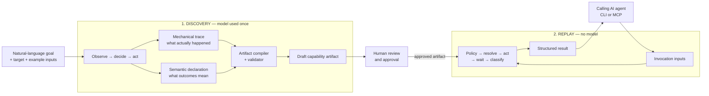

Discovery may use judgment and exploration. Replay cannot: it executes only
the reviewed artifact and returns a declared result.

### The artifact is the boundary

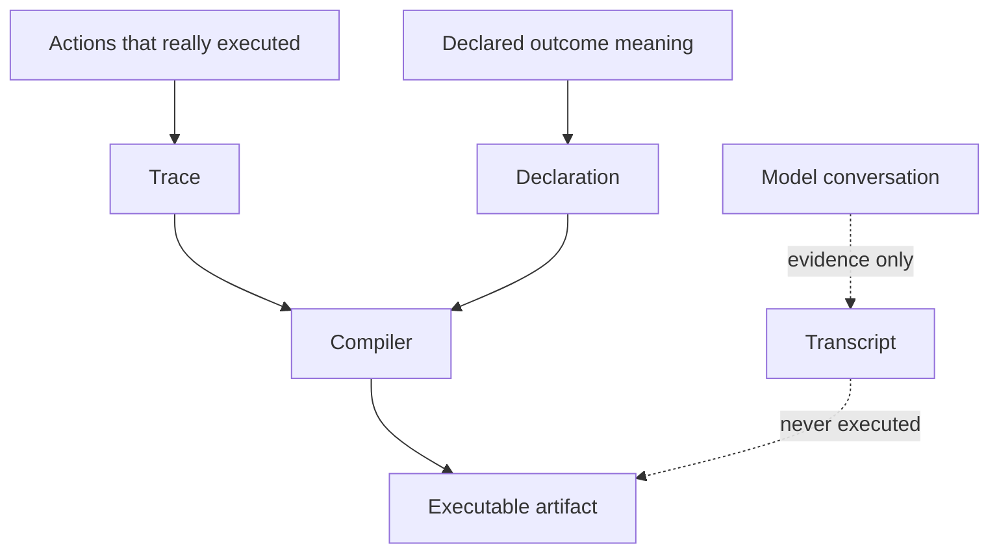

- **Trace:** mechanically captured element metadata, action, frame, value
  reference, wait, and risk.
- **Declaration:** reviewer-visible meaning such as success, not found,
  transient, or escalation.
- **Transcript:** retained as evidence only; replay never interprets it.

## 2. Components and dependency direction

Concrete UI technology stays below `ISurface`. The engine does not reference
Playwright or UIA directly.

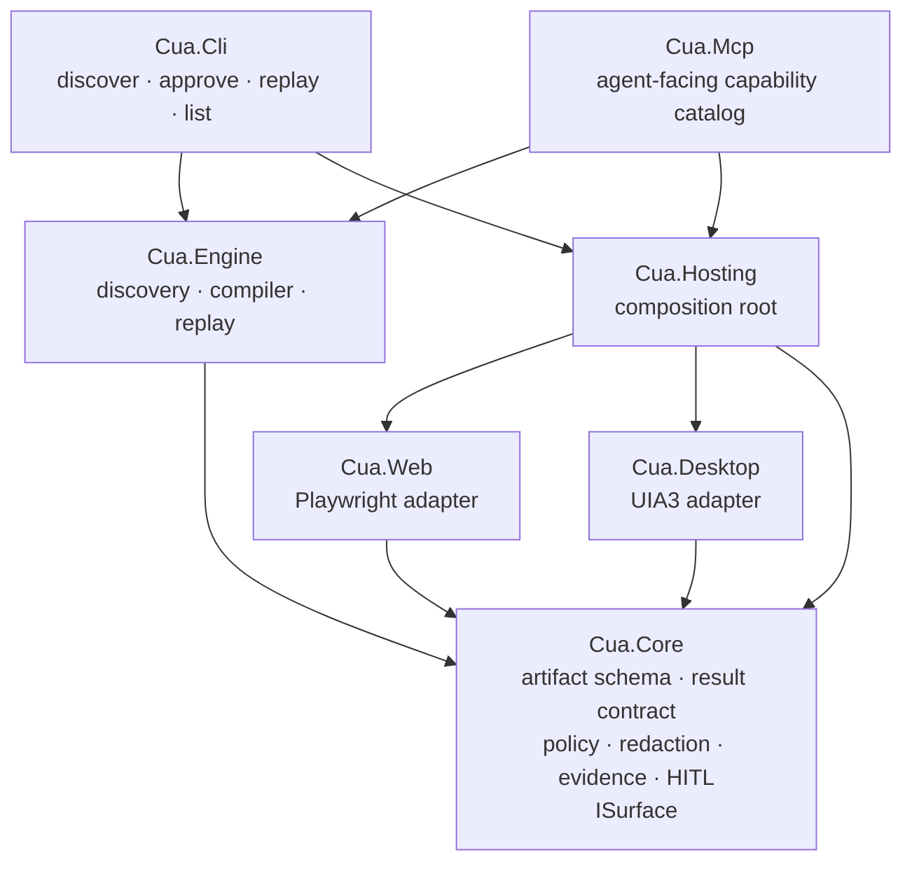

### Responsibilities

- `Cua.Core` defines contracts and has no UI-framework dependency.
- `Cua.Engine` contains the two execution paths.
- `Cua.Web` translates surface-neutral operations into Playwright.
- `Cua.Desktop` translates them into Windows UI Automation.
- `Cua.Hosting` chooses the adapter stamped on the artifact.
- `Cua.Cli` provides the evaluator-facing workflow.
- `Cua.Mcp` exposes approved capabilities as typed agent tools.

## 3. What a capability artifact contains

The artifact is a capability contract, not a raw macro.

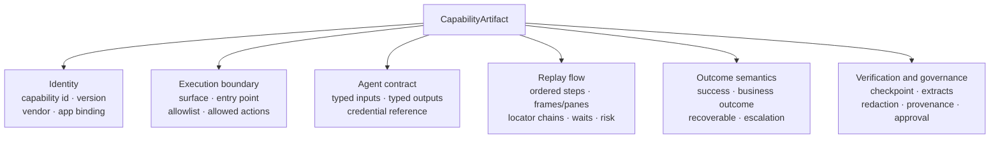

Before compilation, approval, or replay, `ArtifactValidator` checks structural
and semantic invariants:

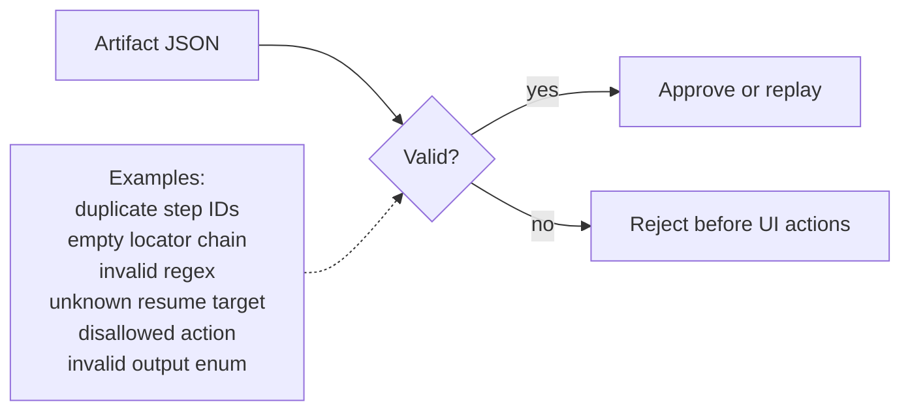

## 4. One replayed step

Every interactive step follows the same bounded sequence.

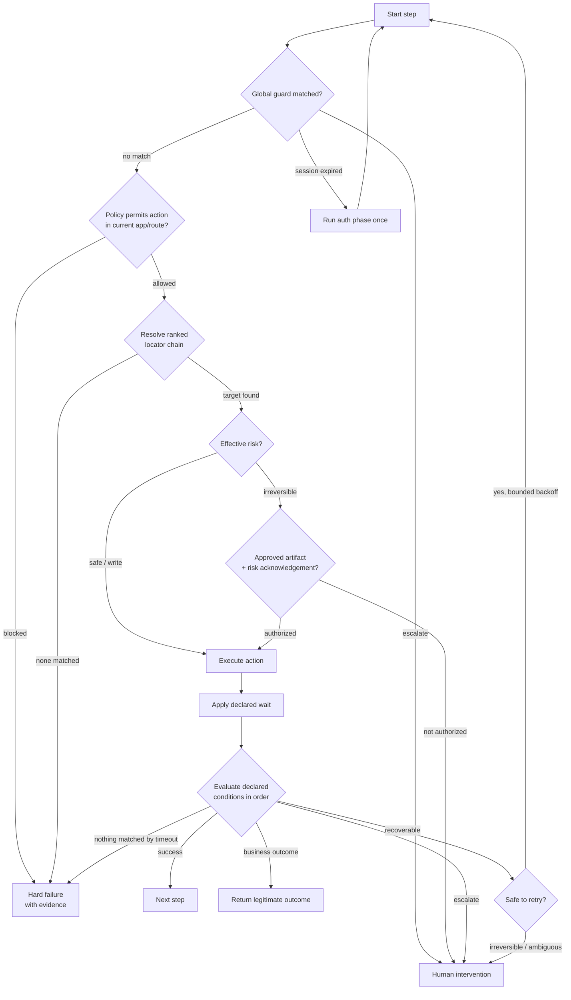

### Result meanings

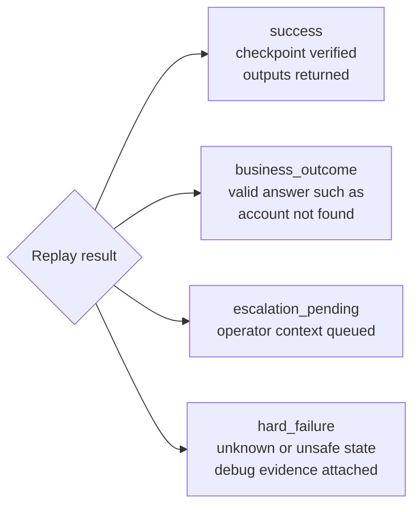

A hard failure is intentionally not declarable as a matching condition. It is
the absence of any recognized outcome before timeout.

## 5. Locator chains and surface abstraction

The artifact uses one vocabulary; each adapter interprets it for its surface.

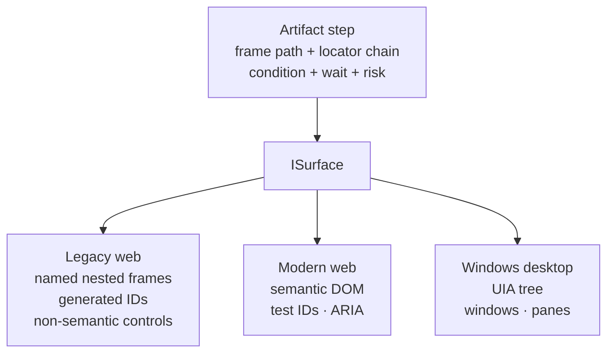

### Resolution order

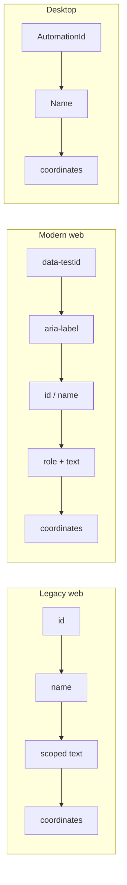

The first candidate that resolves wins. Using a non-primary candidate emits a
`locator_fallback` event. That event is both graceful degradation and a future
drift signal.

Coordinates are deliberately last. They tolerate surfaces with little
structure but are sensitive to window position, scaling, and layout.

## 6. Human escalation and control transfer

### Attended mode: implemented same-session handoff

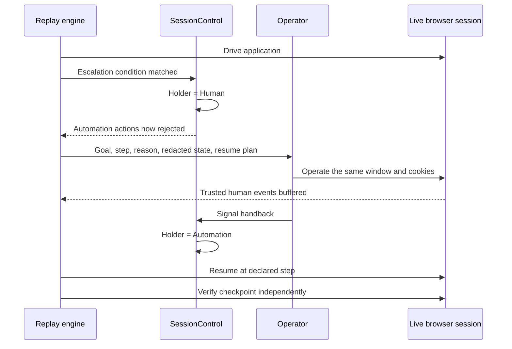

The control token is restored in `finally`, so an operator error cannot leave
automation permanently locked out.

The console channel accepts handback through stdin. The signal-file channel
supports an external/mock operator coordinator: it persists the intervention
request and keeps the process and human control token live until a matching
`.resume` signal arrives. Both channels use the same session and action
recorder; only the handback transport differs.

### Unattended queue: intentionally limited

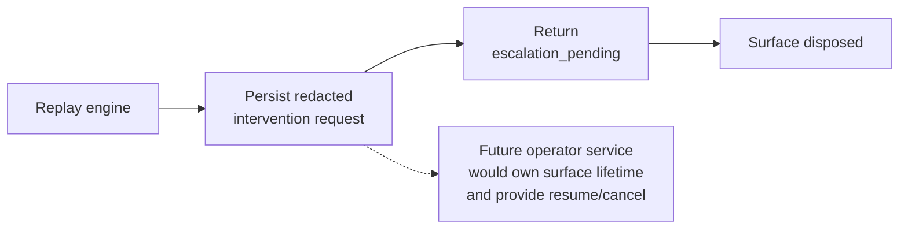

The built-in queue is notification-only. It preserves context and evidence,
not the live browser process. The real handoff required by the assignment is
the attended path above.

## 7. Safety and evidence boundaries

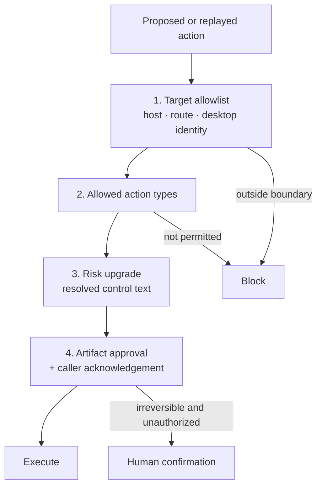

### Data handling

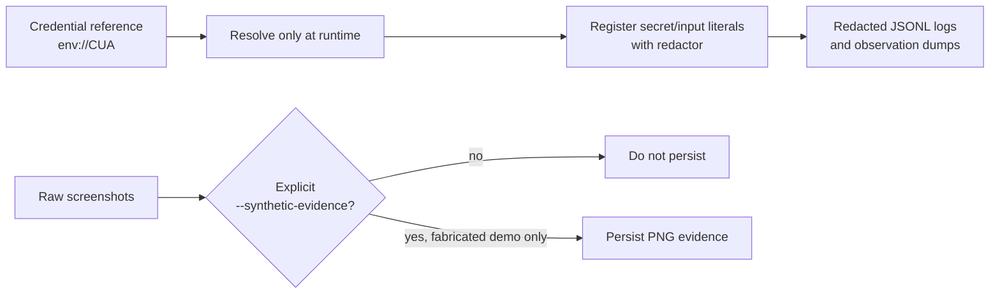

Redaction fails closed if a regex exceeds its timeout. Caller outputs remain
available to the authorized caller, while persisted evidence is redacted.

## 8. Multi-tenant reuse at scale

The design reuses artifacts by vendor product and compatible application
binding rather than recording every capability separately for every tenant.

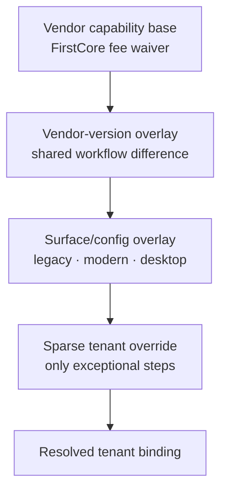

### Tenant onboarding

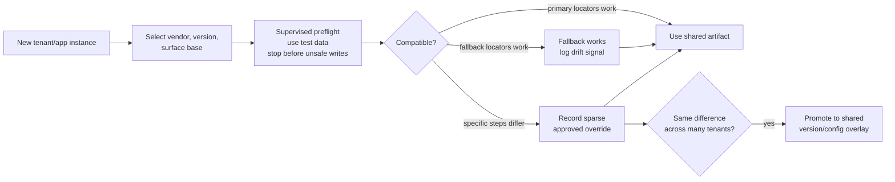

Example for five tenants using one product across three surfaces:

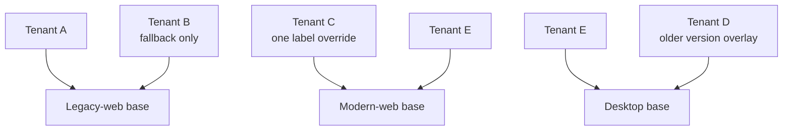

Implemented today:

- vendor metadata and application bindings;
- independent versions per capability/binding;
- ranked locator fallback;
- fallback logging and structured failures;
- a tenant metadata/override seam.

Design-only, as allowed by the assignment:

- tenant-aware routing;
- typed overlay merge and approval;
- tenant-scoped credential service;
- centralized drift aggregation;
- fleet scheduling and storage.

## 9. End-to-end sequence

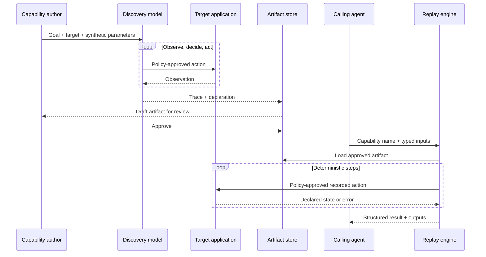

The model discovers. The artifact is the reusable contract. Replay is the
production execution path.
