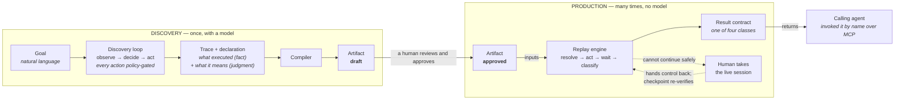
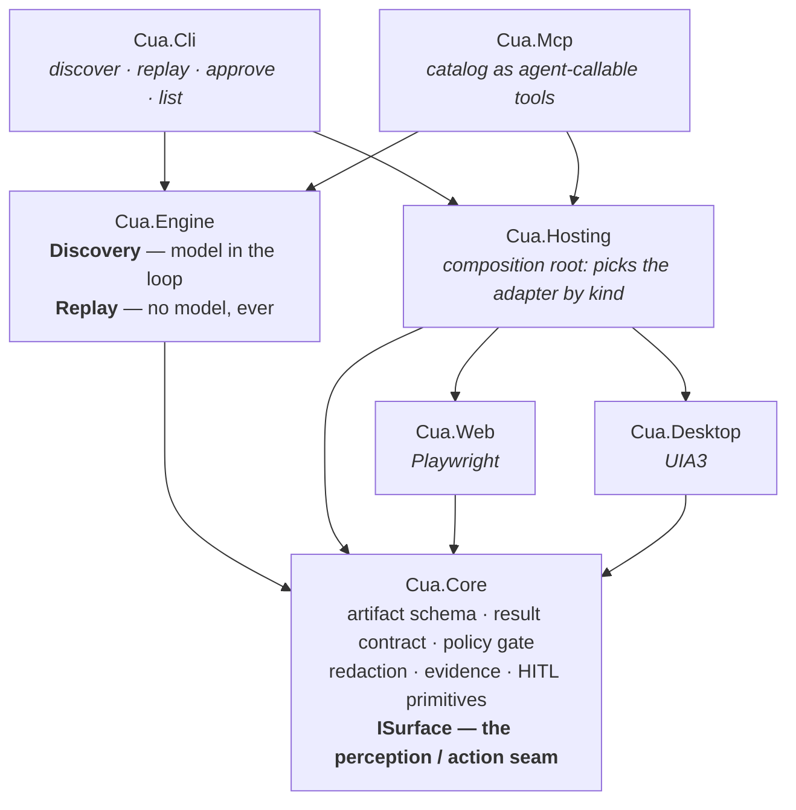
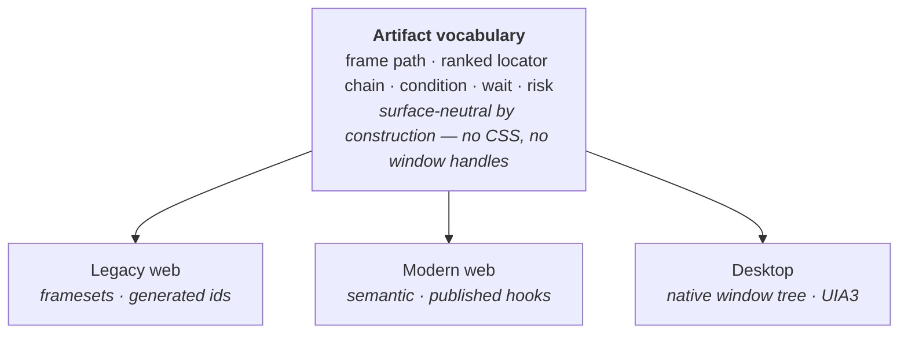
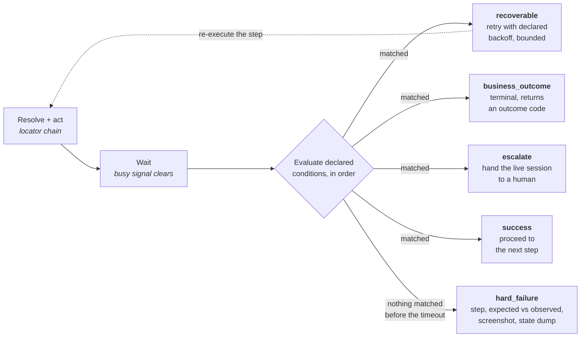
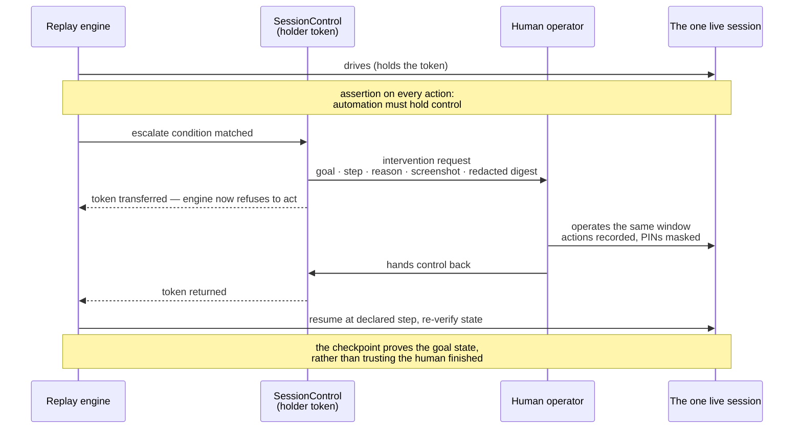
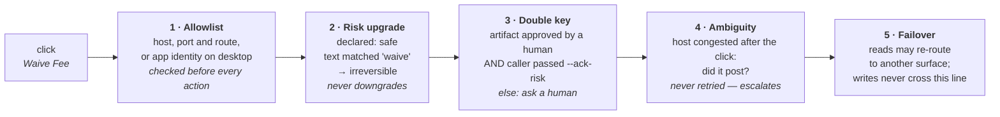
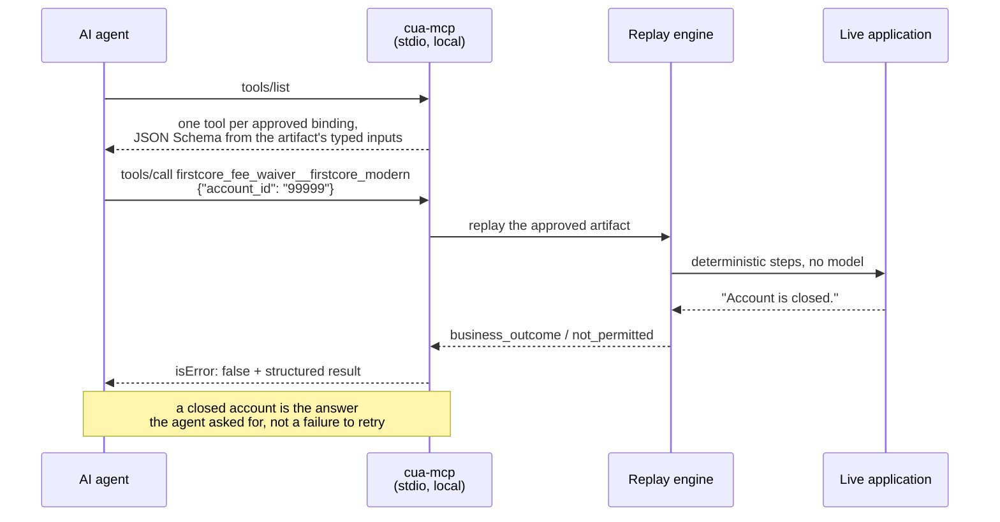

# Architecture

Visual companion to [REPORT.md](../REPORT.md). Diagrams render inline on
GitHub. They describe the system as built and exercised — three surfaces, one
replay engine, five outcome classes proven live on each.

---

## 1. The through-line

Two passes, and everything follows from keeping them apart. Discovery is
expensive, non-deterministic and needs judgment. Replay is cheap, repeatable
and needs none. The artifact is the contract between them, and human approval
is the only door from one into the other.

**The artifact is the seam.** Discovery may be slow and non-deterministic
because it happens once. Everything downstream of the approval gate is
deterministic. Nothing crosses that gate without a person reading it.

| | |
|---|---|
| **trace** | Ground truth, mechanically recorded: which element actually resolved, its id, name, text and position, in which frame. Steps and locators are facts, not model prose. |
| **declaration** | Judgment, declared at record time: which conditions mean success, which are legitimate business answers, which are transient, which need a human. Never inferred during replay. |
| **transcript** | Kept as evidence only. Nothing in the raw model conversation reaches the artifact. |

---

## 2. Assemblies and the direction of dependency

Six assemblies, one-way references, enforced by the compiler rather than by
discipline.

**`Cua.Engine` holds both execution paths and shares nothing but Core with the
adapters.** It has no reference to Playwright or UIA — that was a stale project
reference until it was removed, so the claim is now checked at build time
rather than asserted in a document.

---

## 3. One vocabulary, three surfaces

Everything above `ISurface` speaks frame paths, ranked locator chains and
conditions. What those *mean* is the adapter's business.

| Artifact concept | Legacy web | Modern web | Desktop |
|---|---|---|---|
| frame path | iframe name path | single document | window / pane path |
| rank 1 | `#id` | **`[data-testid]`** | `AutomationId` |
| rank 2 | `[name=…]` | `[aria-label]` | `Name` |
| rank 3 | visible text | `#id` · role | — |
| last resort | coordinates | coordinates | coordinates |

**The ranking inverts between the two web kinds, and that is the whole point of
the distinction.** On a modern app a test id is a contract its author published
for automation, so it outranks the id. On a legacy app no such hook exists and
generated `ext-genNN` ids churn between vendor releases, so text and position
carry the fallback weight. Coordinates sit last everywhere — the one rank that
still resolves on a surface with no structure at all.

The same capability is recorded once per surface as sibling artifacts with
identical inputs and outputs; `cua list` shows one capability, three bindings.

---

## 4. What a replayed step decides

The interesting failures in a bank are not layout drift — these screens barely
change. They are the runtime conditions: a congested host link, a closed
account, a supervisory hold, a dead session.

**There is deliberately no `hard_failure` condition to declare.** A hard failure
is the *absence* of any recognised outcome when the step times out — never
something matched by a pattern. That makes the classic mistake, conflating "no
such account" with a crash, impossible to express in an artifact.

| Result class | Meaning |
|---|---|
| `success` | Checkpoint verified independently of the last click. Declared outputs returned. |
| `business_outcome` | **An answer, not an error.** "Account is closed" is what the caller asked to find out. |
| `escalation_pending` | Parked for an operator with full context. The run is not failed — it is waiting. |
| `hard_failure` | The state was unrecognised. Carries step, expected, observed and evidence to debug. |

> **One rule the engine enforces over the artifact.** A transient matched on an
> **irreversible** step never retries. The fee may already have posted, so
> re-clicking risks a double reversal. It escalates instead, and the checkpoint
> re-verifies state after handback. An artifact cannot opt out of this.

---

## 5. Handing over the live session

The hard part of human-in-the-loop is not detecting "stuck" — it is that the
human must land in *the same session*, with the same cookies and the same
half-finished transaction. A fresh window cannot clear a modal that only exists
in the one the automation was driving.

**Control is a token, not a convention.** Attended mode gives the operator the
real window; unattended mode persists the intervention request and returns
`escalation_pending` with evidence preserved — the same seam, a different
operator surface.

---

## 6. Where a fee waiver meets the guardrails

One click through every layer. The model under-declared it as safe; it still
could not run unattended without a person having read the recording first.

**The durable control is gate 3, not the keyword list.** Text patterns are an
English-language heuristic and a determined counter-example gets past them; "a
human read this exact recording and approved it" does not depend on guessing
what a button is called.

Secrets never enter the artifact: it stores a credentials *reference*, and
resolved values are registered with the redactor before the first log line is
written. Persisted screen captures get a stricter tier that also masks
account-shaped digit runs, protecting bystanders visible on a shared screen.

---

## 7. What the calling agent sees

The catalog is served over MCP. Approved artifacts become callable tools whose
schemas are derived from their own typed inputs; every artifact, drafts
included, stays readable as a resource.

**Callable and reviewable are deliberately different sets** — the approval gate
expressed in the protocol. A capability that exists only as a draft is refused
by name, stating its approval state.

The transport is stdio: the client spawns the server as a child process, so
there is no listening socket. That is forced by the work — the server drives a
real browser or a real window and must be on the machine that owns that session.
`CapabilityServer` takes a `TextReader`/`TextWriter`, so a remote HTTP
transport swaps in without touching catalog, tool generation or invocation.

---

## 8. Scaling the idea, not the infrastructure

Hundreds of institutions run the same vendor products, configured and branded
differently. The unit of reuse is the vendor-product artifact, never the tenant
recording.

| | |
|---|---|
| **`app_binding`** | One capability can exist on the web portal, a legacy console *and* the thick client. Sibling recordings version independently, so a desktop recording is never mistaken for the web artifact's next version. |
| **tenant overrides** | A new tenant replays the base artifact supervised. Locator fallback hits and hard failures identify *which steps* need specialising — recorded as sparse overrides, never a fork. |
| **drift signal** | Every replay logs which locator rank actually resolved. A tenant drifting onto fallback ranks is flagged for re-validation *before* it breaks. |
| **routing** | Callers ask for a capability; a per-tenant policy picks the binding deterministically before the run starts — pin, then approval state, then replay-stability history. |

**Deliberately not built:** the tenant override resolver, the routing engine,
stability scoring and a real operator console. Each has a clean seam and none is
load-bearing for the thesis; building that infrastructure before the
abstractions are proven would be the more expensive mistake. See REPORT §7.
